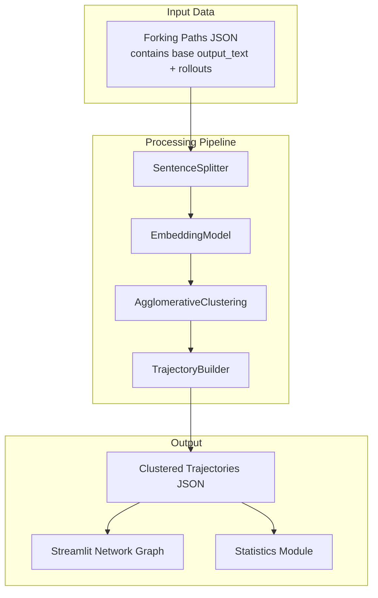

# Semantic Clustering for Forking Paths (Revised)

## Key Changes from Initial Plan

- **String positions** instead of token positions for all operations
- **Base solution** comes from forking paths JSON (`output_text` field)
- **Trajectory starts** at the exact sentence before the fork (determined by `t` field)
- **Agglomerative clustering** from sklearn instead of HDBSCAN
- **Custom sentence splitting** with `<think>`/`</think>` as delimiters

## Architecture Overview



## Data Structure

**Input** (from `data/forking_paths/.../00.json`):

```python
[
  {
    "t": 42,  # character position where fork occurs
    "output_text": "Full rollout text...",
    "post_stump_output_text": "Text after the stump...",
    "clean_answer": "A",
    ...
  },
  ...  # ~6000 rollouts per prompt, grouped by t values
]
```

**Output** (per prompt file):

```json
{
  "42": {
    "base_sentence": ["The sentence before fork at t=42.", 5],
    "trajectory_0": [[0.0, 5, "Sentence 1"], [0.12, 8, "Sentence 2"], ...],
    "trajectory_1": [[0.0, 5, "Sentence 1"], [0.15, 12, "Different path"], ...]
  },
  "108": { ... }
}
```

- `t_norm = char_position / len(base_output_text)` (string length, not tokens)
- Consecutive sentences in same cluster are merged

## File Structure

```
cluster_utils/
├── __init__.py
├── sentence_splitter.py      # Custom splitter with <think>/<think> support
├── embedding.py              # EmbeddingModel (sentence-transformers)
├── clustering.py             # AgglomerativeClustering wrapper (sklearn)
├── trajectory.py             # TrajectoryBuilder - maps sentences to clusters
├── io.py                     # Load forking paths JSON, save trajectories
└── stats.py                  # Graph width, convergence (string-based), independence

cluster_trajectories.py       # Main script with --start_index/--end_index
cluster_streamlit_app.py      # Network graph visualization
```

## Implementation Details

### 1. Sentence Splitter ([`cluster_utils/sentence_splitter.py`](cluster_utils/sentence_splitter.py))

Use the provided logic with these additions:

- Treat `<think>` and `</think>` as sentence delimiters
- Return `list[tuple[str, int, int]]` → (sentence, start_char, end_char)
- Track character positions for timestamp calculation
```python
SENTENCE_DELIMITERS = ".!?\n"
SPECIAL_DELIMITERS = ["<think>", "</think>"]

def split_into_sentences(text: str) -> list[tuple[str, int, int]]:
    # ... provided logic + handle <think>/<think> tags
    # Returns: [(sentence, start_pos, end_pos), ...]
```


### 2. Embedding Model ([`cluster_utils/embedding.py`](cluster_utils/embedding.py))

```python
class EmbeddingModel(ABC):
    @abstractmethod
    def embed(self, sentences: list[str]) -> np.ndarray: ...

class SentenceTransformerEmbedding(EmbeddingModel):
    def __init__(self, model_name: str = "all-MiniLM-L6-v2"): ...
```

### 3. Clustering Engine ([`cluster_utils/clustering.py`](cluster_utils/clustering.py))

```python
class ClusteringEngine(ABC):
    @abstractmethod
    def fit_predict(self, embeddings: np.ndarray) -> np.ndarray: ...

class AgglomerativeClusteringEngine(ClusteringEngine):
    def __init__(self, n_clusters: int = None, distance_threshold: float = 1.0):
        # Use sklearn.cluster.AgglomerativeClustering
        # distance_threshold for automatic cluster count when n_clusters=None
```

### 4. Trajectory Builder ([`cluster_utils/trajectory.py`](cluster_utils/trajectory.py))

```python
class TrajectoryBuilder:
    def build_trajectories(
        self,
        forking_data: list[dict],  # All rollouts for one prompt
        base_output_text: str,     # From first rollout (all share same base)
        cluster_assignments: dict[str, int],  # sentence -> cluster_id
    ) -> dict:
        # Group rollouts by t (fork position)
        # For each t:
        #   - base_sentence = sentence ending at position t in base_output_text
        #   - For each rollout: build trajectory starting from base_sentence
        #   - t_norm = char_position / len(base_output_text)
        #   - Merge consecutive sentences with same cluster_id
```

### 5. Statistics ([`cluster_utils/stats.py`](cluster_utils/stats.py))

- **Graph width at t**: Count unique clusters across all trajectories at normalized time t
- **Convergence**: Adapt [`utils/cot_analysis.py`](utils/cot_analysis.py) to use string positions
- **Independence**: Compare cluster distributions across different prompts

### 6. Streamlit App ([`cluster_streamlit_app.py`](cluster_streamlit_app.py))

- **Network graph** (Plotly): nodes = clusters, edges = transitions
- **Node size** ∝ number of trajectories passing through
- **Timestep slider** to filter trajectories up to selected t_norm
- **Hover** shows representative sentences
- **Convergence indicator** from cot_analysis (string-based)
- Prompt selector + t_start selector

## Processing Script

```bash
python cluster_trajectories.py \
  --model_name deepseek-ai/DeepSeek-R1-Distill-Llama-8B \
  --dataset_name gpqa \
  --start_index 0 \
  --end_index 5 \
  --n_clusters 50  # or --distance_threshold 1.0
```

## Dependencies to Add

```toml
sentence-transformers>=2.2.0
networkx>=3.0
```

(sklearn already available, no HDBSCAN needed)